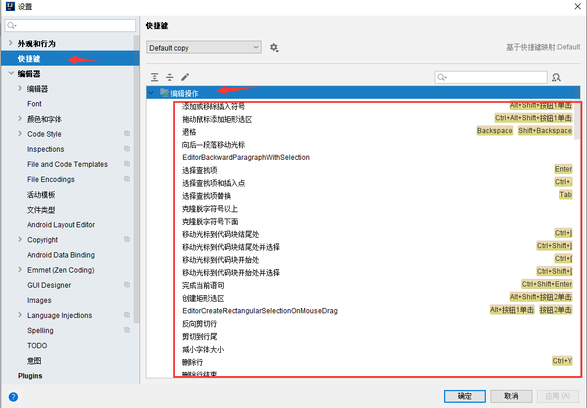
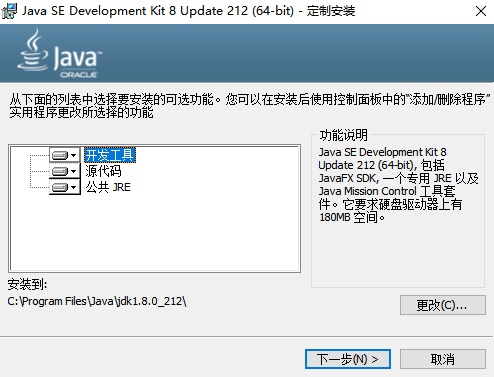
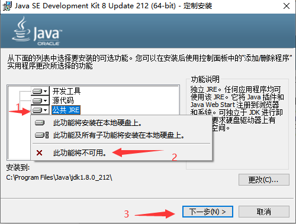
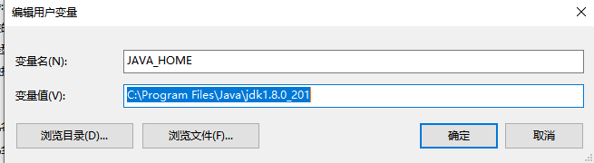
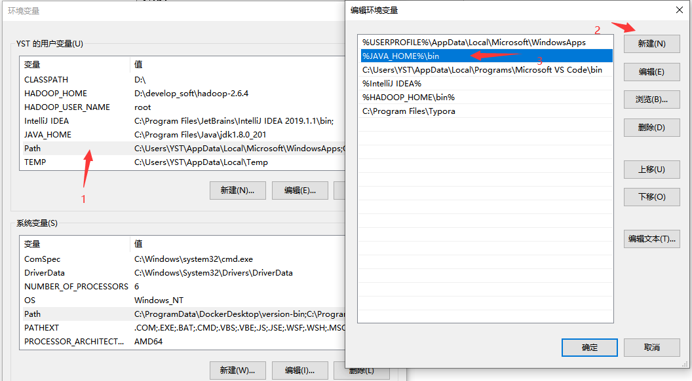
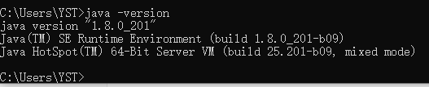
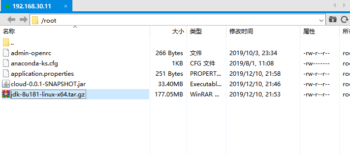
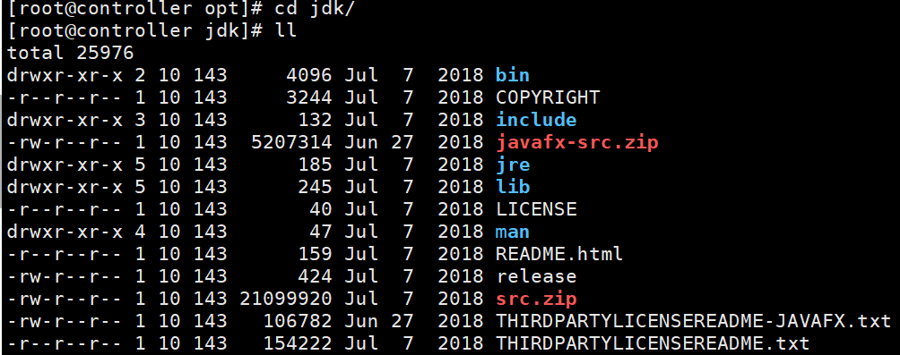
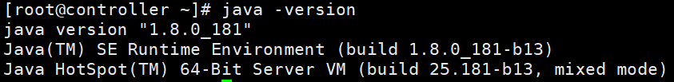

# 一、开发工具使用及java基础语法

## 1、开发工具IDEA使用 

- IDEA工具介绍

  1）设置主题：

  ​	在文件——设置——外观和行为——Appearance——Theme

  

  2）设置字体

  ​	文件——设置——编辑器——Font——大小

  

  3）设置本地历史显示

  

-  IDEA工具高频快捷键

  | Ctrl+W           | 选中单词      |
  | ---------------- | ------------- |
  | Alt+Enter        | 智能提示      |
  | Ctrl+(Shift)+/   | 行注释/块注释 |
  | Ctrl+Alt+Shift+J | 列操作        |
  | Ctrl+Alt+L       | 格式化代码    |
  | Ctrl+B           | 转到代码声明  |

- 自定义快捷方式

  文件——设置——快捷键——编辑操作

  

## 2、JAVA环境安装及配置

### 2.1 Windows环境设置

（1）双击进行安装界面如下所示：



（2）取消安装公共JRE



（3）配置环境变量：

- 此电脑→属性→高级系统设置→高级→环境变量，在系统变量中配置。
- 配置JAVA_HOME。新建，变量名JAVA_HOME，变量值，jdk路径，我的路径是C:\Program Files\Java\jdk1.8.0_212，确定。



- 打开Path变量，在变量值最前加入%JAVA_HOME%\bin



（4）验证

- 运行cmd，输入java -version，显示java版本则成功。

  

### 2.2 Linux环境设置

（1）把需要的JDK1.8的tar包上传到Linux系统中。



（2）解压tar包，并重命名目录为jdk

- ​	解压包到/opt指定目录下：

```
[root@controller ~]# tar -zxvf jdk-8u181-linux-x64.tar.gz -C /opt/

```

- 解压后文件目录



（3）配置环境变量

- 在指定目录下创建java.sh脚本文件

```
[root@controller ~]# vi /etc/profile.d/java.sh
```

- 在新建的文件中添加如下内容

```
export JAVA_HOME=/opt/jdk
export PATH=$PATH:$JAVA_HOME/bin
```

- 重新编译profile文件

```
[root@controller ~]# source /etc/profile
```

（4）验证

```
[root@controller ~]# java -version
```



### 2.3  JDK、JRE、JVM的关系及相关原理

- JDK、JRE、JVM关系

  .png)

- JVM运行原理

  .png)

## 3、JAVA基础语法串讲

### 	3.1 Java数据类型

- 基本数据类型

|  类型  | 占用空间（字节/位） |       范围       |  封装类   |
| :----: | :-----------------: | :--------------: | :-------: |
| boolen |         1/8         |     -2⁷~2⁷-1     |  Boolean  |
|  byte  |         1/8         |     -2⁷~2⁷-1     | **Byte**  |
| short  |        2/16         |    -2¹⁵~2¹⁵-1    |   Short   |
|  char  |        2/16         |    -2¹⁵~2¹⁵-1    | Character |
|  int   |        4/32         |    -2³¹~2³¹-1    |  Integer  |
|  long  |        8/64         |    -2⁶³~2⁶³-1    |   Long    |
| float  |        4/32         |  3.4e-45~1.4e38  |   Float   |
| double |        8/64         | 4.9e-324~1.8e308 |  Double   |

- 引用类型

  String，Class，enum

## 4、装箱与拆箱

- 概念：

   装箱就是 自动将基本数据类型转换为包装器类型；拆箱就是 自动将包装器类型转换为基本数据类型

- ​	装箱的好处：

​		1）把一个基本类型包装成一个类，一个是可以使这个类型具有很多可以调用的方法。

​		 2）Java向面像对象语言的靠近。其实Java还不算是很纯的面向对象的语言。真正的面向对象，

​		 3）在泛型中，基本类型是不可以做泛型参数的

